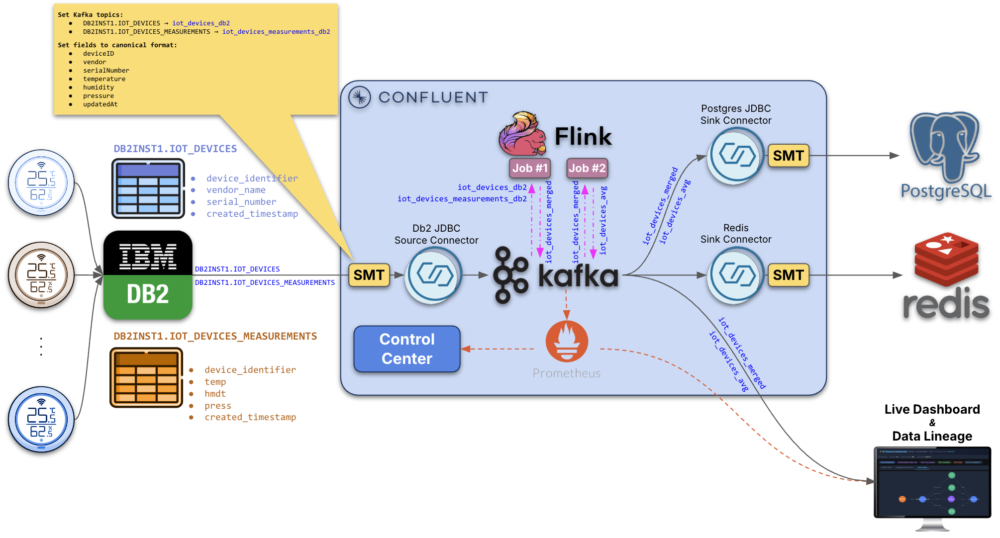
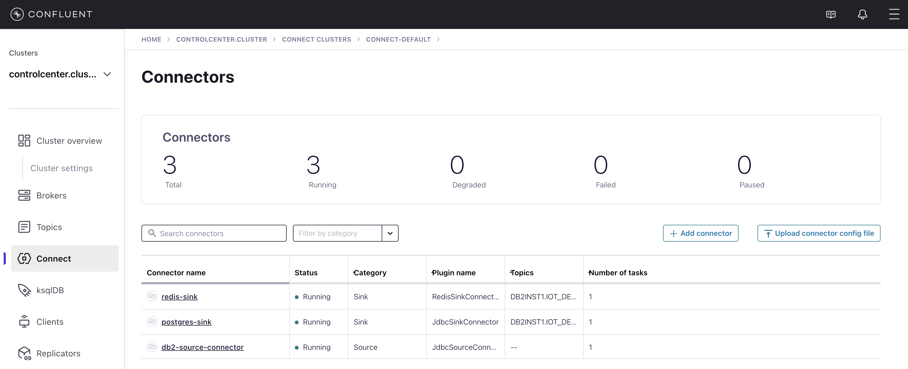
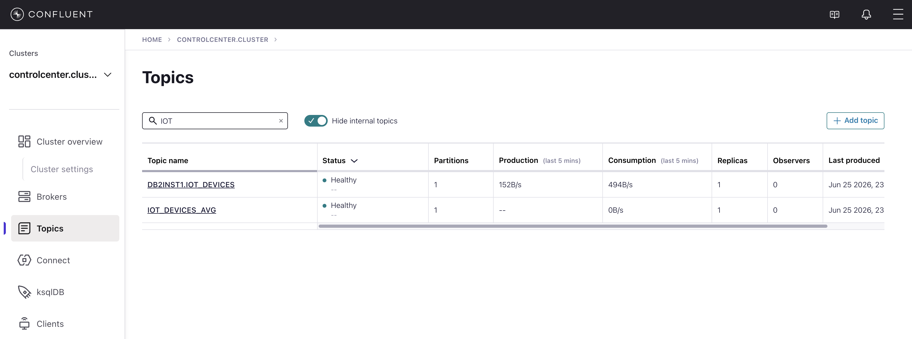
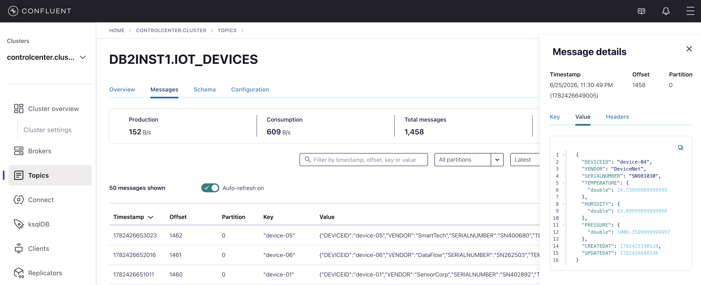
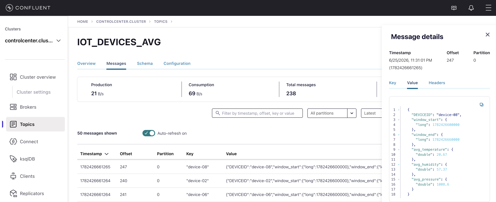
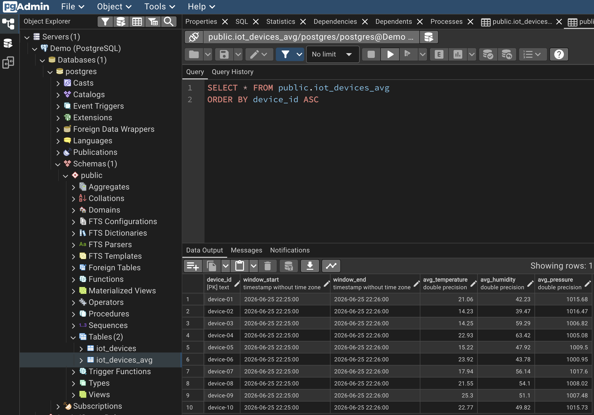
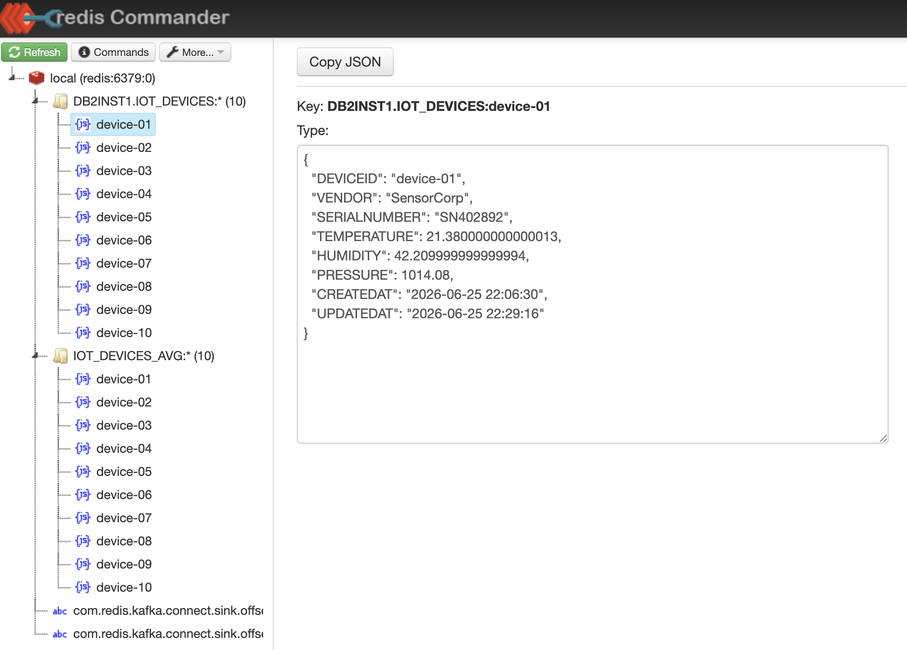
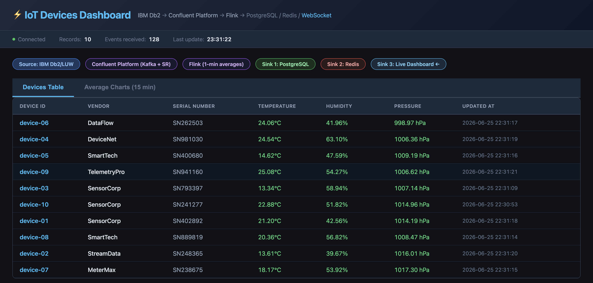
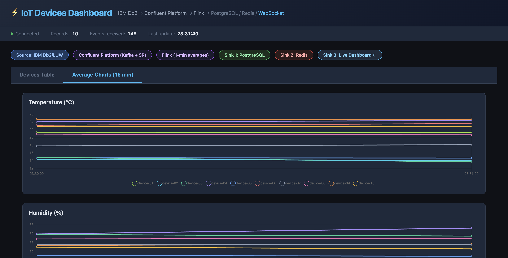
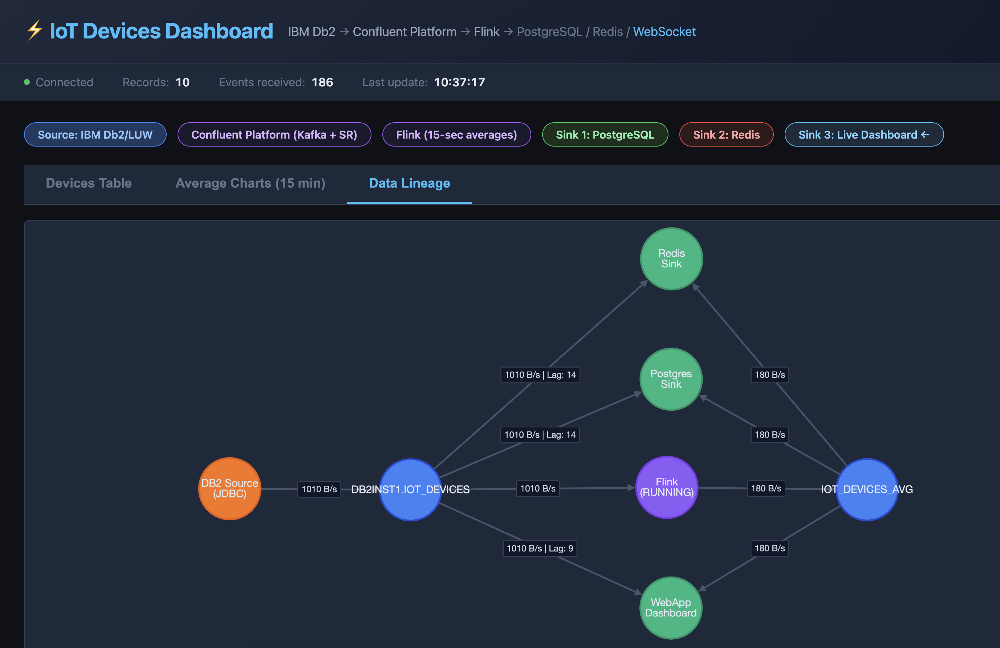

# IoT Devices → Confluent Platform → Flink - Live Pipeline Demo

This demo shows how to build a **live data pipeline** from IBM Db2 (IoT source) through Confluent Platform, with **Flink stream processing** to calculate 15-second rolling averages, and a **1:3 fanout** to PostgreSQL, Redis, and a Python/React frontend. The pipeline is fully containerized and runs locally using Docker Compose.

## Architecture



A **data generator** container continuously inserts new sensor readings for 10 IoT devices (append-only, no updates) at 2 rows/second. Device metadata (identifier, vendor, serial number) is stable per device; only sensor values vary per insert. Raw data flows through Confluent to all three sinks simultaneously. In parallel, **Flink** calculates 15-second tumbling window averages per device/metric using the Window TVF API (with a 10-second late-event watermark) and writes results to a separate topic, which is also consumed by all three sinks. The **frontend** has three tabs: live device data table, line charts of the last 15 minutes of averages, and a real-time **data lineage graph** showing the full pipeline topology with throughput metrics.

## Prerequisites

- **Docker Desktop ≥ 4.x** - at least **8 GB RAM** allocated, **15 GB** free disk space
  ```bash
  brew install --cask docker
  ```
- **Apple Silicon (M1/M2/M3):** Rosetta 2 handles the `linux/amd64` Db2 image automatically - no extra configuration needed

## Quick Start

### 1. Start the stack

```bash
./start.sh
```

The first run pulls all images and builds the custom containers - allow **5~10 minutes**. Subsequent restarts are fast (~30 s) because data volumes are preserved.

`start.sh` waits for Schema Registry, Kafka Connect, Control Center, Flink, and pgAdmin to be healthy, then prints the service URLs.

### IBM Db2 (`localhost:50000`)

**Table: `DB2INST1.IOT_DEVICES`** — 10 IoT devices with sensor readings

| Column | Type | Notes |
|--------|------|-------|
| `device_identifier` | VARCHAR(50) | Stable per device, e.g., `device-01` |
| `vendor_name` | VARCHAR(100) | Stable per device |
| `serial_number` | VARCHAR(100) | Stable per device |
| `temp` | DOUBLE | Sensor reading in °C (~5–35), varies per insert |
| `hmdt` | DOUBLE | Sensor reading in % (~30–75), varies per insert |
| `press` | DOUBLE | Sensor reading in hPa (~1000–1025), varies per insert |
| `created_timestamp` | TIMESTAMP | Insert time (no updates — table is append-only) |

> **Canonical format normalization:** The Db2 source connector applies a `ReplaceField` SMT that renames these Db2-specific column names to a canonical format (`deviceID`, `vendor`, `serialNumber`, `temperature`, `humidity`, `pressure`, `updatedAt`) before publishing to Kafka. This decouples the Db2 schema from the rest of the pipeline — any future Db2 column renames only require updating the SMT mapping, with zero changes downstream (Flink, sinks, frontend).
>
> The table is **insert-only** (commit log pattern) — DB2 never updates rows. Upsert semantics are applied at the sink level (PostgreSQL and Redis always reflect the latest reading per device).

```
Database: testdb
User    : db2inst1
Password: db2inst1-pwd
JDBC URL: jdbc:db2://localhost:50000/testdb
```

Open a Db2 CLI session:
```bash
docker exec -it db2-luw su - db2inst1
```

```sql
db2 connect to testdb
db2 "SELECT * FROM DB2INST1.IOT_DEVICES"
db2 "SELECT COUNT(*) FROM DB2INST1.IOT_DEVICES"
```

Watch rows being inserted live (refreshes every second):
```bash
./watch-db2.sh
```

### 2. Deploy connectors

In a second terminal, once `start.sh` has printed the service URLs:

```bash
./deploy-connectors.sh
```

This step waits for DB2 and the `IOT_DEVICES` table to exist, then deploys all three connectors (Db2 source + PostgreSQL sink + Redis sink) and verifies they reach `RUNNING` state.



### 3. Deploy the Flink averaging job

Once the source connector is running and populating the `iot_devices_db2` topic:

```bash
./deploy-flink-job.sh
```

This submits the Flink INSERT job, which starts calculating 15-second tumbling window averages. Results are written to `iot_devices_avg` and propagate to all sinks automatically.

### 4. Watch the data flow

| Interface | URL | Credentials |
|---|---|---|
| **Live Dashboard** | http://localhost:5001 | - |
| **Control Center** | http://localhost:9021 | - |
| **pgAdmin** | http://localhost:5050 | admin@admin.org / admin |
| **Redis Commander** | http://localhost:8087 | - |
| **Kafka Connect API** | http://localhost:8083 | - |
| **Schema Registry** | http://localhost:8081 | - |
| **Prometheus** | http://localhost:9090 | - |
| **Flink UI** | http://localhost:9081 | - |

## Stopping

```bash
# Stop - preserves nothing (clean slate on next start)
./stop.sh
```

## Service Details

### Kafka Topics

Two topics are created automatically by the pipeline:

1. **`iot_devices_db2`** — Raw device data from Db2 source connector (~2 inserts/sec, polled every 500 ms)
2. **`iot_devices_avg`** — 15-second tumbling window averages from Flink (~1 update/15 sec per device)



**`iot_devices_db2` — raw device messages:**



**`iot_devices_avg` — Flink window average messages:**



```bash
# List topics
docker exec broker kafka-topics --bootstrap-server localhost:9092 --list

# Consume raw device records
docker exec schema-registry kafka-avro-console-consumer \
  --bootstrap-server broker:29092 \
  --topic iot_devices_db2 \
  --from-beginning

# Consume average records
docker exec schema-registry kafka-avro-console-consumer \
  --bootstrap-server broker:29092 \
  --topic iot_devices_avg \
  --from-beginning

# Check consumer group lag
docker exec broker kafka-consumer-groups \
  --bootstrap-server localhost:9092 \
  --group connect-postgres-iot-devices-sink \
  --describe

# Check all consumer groups
docker exec broker kafka-consumer-groups \
  --bootstrap-server localhost:9092 \
  --list
```

### PostgreSQL (`localhost:5432`)

Two tables are created automatically by the sink connector:

- **`iot_devices`** — raw device data (from `iot_devices_db2` topic)
- **`iot_devices_avg`** — 15-second window averages (from `iot_devices_avg` topic)



```
Database: postgres
User    : postgres
Password: postgres
```

```bash
docker exec -it postgres psql -U postgres -d postgres -c 'SELECT * FROM iot_devices LIMIT 10;'
docker exec -it postgres psql -U postgres -d postgres -c 'SELECT * FROM iot_devices_avg ORDER BY window_end DESC LIMIT 10;'
```

pgAdmin is pre-configured with a **Demo - PostgreSQL** server. Open http://localhost:5050 and expand the server tree — no manual setup required.

### Redis (`localhost:6379`)

Device records and averages are stored as RedisJSON. Both topics share one connector; device records are stored under keys matching the device ID (e.g., `device-01`).



```bash
# List all device keys
docker exec -it redis redis-cli KEYS "*device*"

# Read one device record
docker exec -it redis redis-cli JSON.GET device-01

# Total key count
docker exec -it redis redis-cli DBSIZE
```

Browse all keys visually at http://localhost:8087 (Redis Commander).

### Python/React Frontend (`localhost:5001`)

The frontend automatically consumes from both Kafka topics and displays live data.

**Devices Table** — raw device readings updated in real-time:



**Average Charts** — 15-second rolling averages per metric, one line per device:



**Data Lineage** — live pipeline topology graph showing nodes (DB2 Source → Kafka Topics → Flink → Sinks) with real-time bytes/sec throughput and consumer lag per edge:



Data updates via WebSocket in real-time. Connection status and event counts shown in the status bar.

## Connector Management

Three connectors are deployed: `db2-source-connector`, `postgres-iot-devices-sink`, and `redis-iot-devices-sink`.

```bash
# Status of all connectors
curl -s http://localhost:8083/connectors?expand=status | python3 -m json.tool

# Status of a single connector
curl -s http://localhost:8083/connectors/db2-source-connector/status | python3 -m json.tool

# Restart a connector
curl -X POST http://localhost:8083/connectors/db2-source-connector/restart

# Re-deploy all connectors (safe to re-run)
./deploy-connectors.sh
```

## Flink Job Management

```bash
# Monitor Flink job logs
docker logs flink-jobmanager

# Deploy/restart the averaging job
./deploy-flink-job.sh
```

The Flink table definitions (`iot_devices_source` and `iot_devices_avg`) and the INSERT job are both submitted by `deploy-flink-job.sh`. The script uses the `flink-sql-client` container to run the SQL non-interactively.

The job uses a **15-second tumbling window** (Window TVF API) on the `updatedAt` watermark with a **10-second late-event tolerance**, producing averages per device every 15 seconds. Results are written to `iot_devices_avg` via upsert-kafka with Avro encoding.

> **Note:** Flink tracks its read position using its own state backend, not Kafka's `__consumer_offsets`. Consumer group lag shown in the Data Lineage tab is therefore omitted for the IOT_DEVICES→Flink edge — it is not meaningful for Flink sources.

## Troubleshooting

**DB2 data generator shows "not ready yet" on startup** — normal. DB2 takes 15–30 s to resume from a preserved volume, and 3–5 min on a full reset. The generator loops patiently until the JDBC port is open and the `IOT_DEVICES` table exists.

**Source connector in FAILED state** — run `./deploy-connectors.sh` again; the script automatically waits for DB2 and retries failed connectors.

**pgAdmin "no password supplied" error** — `start.sh` seeds the password automatically. If you skip `start.sh` and start containers manually, run:
```bash
./start.sh   # re-seeds the pgAdmin password as part of startup
```

**Port conflict** — check which process owns the port:
```bash
lsof -i :50000   # DB2
lsof -i :9021    # Control Center
```

## Resources

- [Confluent JDBC Connector docs](https://docs.confluent.io/kafka-connectors/jdbc/current/index.html)
- [Redis Kafka Connector docs](https://redis.io/docs/latest/integrate/kafka/)
- [IBM Db2 Community Edition](https://www.ibm.com/docs/en/db2/11.5)
- [Apache Flink SQL docs](https://nightlies.apache.org/flink/flink-docs-stable/docs/dev/table/sql/overview/)
- [Confluent Control Center](http://localhost:9021)
